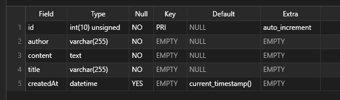

# Del 3 - Databasdesign

Databasen behöver designas utifrån vad du önskar spara i den. Ta en stund och fundera igenom vilka fält du behöver spara i din databas. Vilka datatyper ska de ha?

- [ ] Förstå SQL frågor, datatyper och struktur
- [ ] Grundläggande databasdesign och SQL frågor

### Vilka kolumner behöver vi?

För en forum-post vill vi ha ett antal kolumner. Vem som har skrivit posten, titeln, innehållet och när posten skapades.

I den här beskrivningen så är namn på svenska, men i databasen så är det enklast att använda engelska (funktionsmässigt).

### Vilka datatyper behöver vi?

- författare, ett namn varchar(255)
- titel, text, men inte för lång varchar(255)
- innehåll, text
- skapad, datum

För att ändra i tabellen så behöver vi skriva SQL frågor för att göra detta.

```sql
ALTER TABLE DITT_TABELL_NAMN ADD author VARCHAR(255) NOT NULL;
ALTER TABLE DITT_TABELL_NAMN ADD title VARCHAR(255) NOT NULL;
ALTER TABLE DITT_TABELL_NAMN ADD content TEXT NOT NULL;
ALTER TABLE DITT_TABELL_NAMN ADD createdAt DATETIME DEFAULT CURRENT_TIMESTAMP;
```

För att inspektera tabellen med sql så kan du använda frånga `DESCRIBE`

```sql
DESCRIBE DITT_TABELL_NAMN;
```



Tabellen för forumet är nu klar och nästa steg är att fylla den med data.

### Skapa data

Skapa data, du kan använda Tableplus eller skriva en sql-fråga.
**Testa båda!**

```sql
INSERT INTO DITT_TABELL_NAMN (author, title, content) VALUES ('Jens', 'Hej', 'Detta är ett test');
```

### Visa data

För att välja, visa data från en SQL databas så används select. Du väljer innehållet och databasen svarar med data.

```sql
SELECT * FROM DITT_TABELL_NAMN;
```

**Starta din server och se till att allt fungerar!**

[Del 4](part-4.md)
